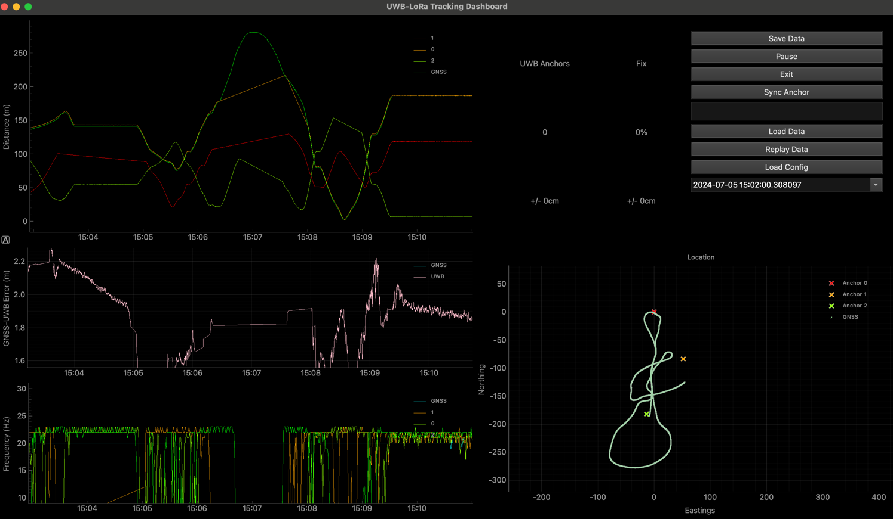
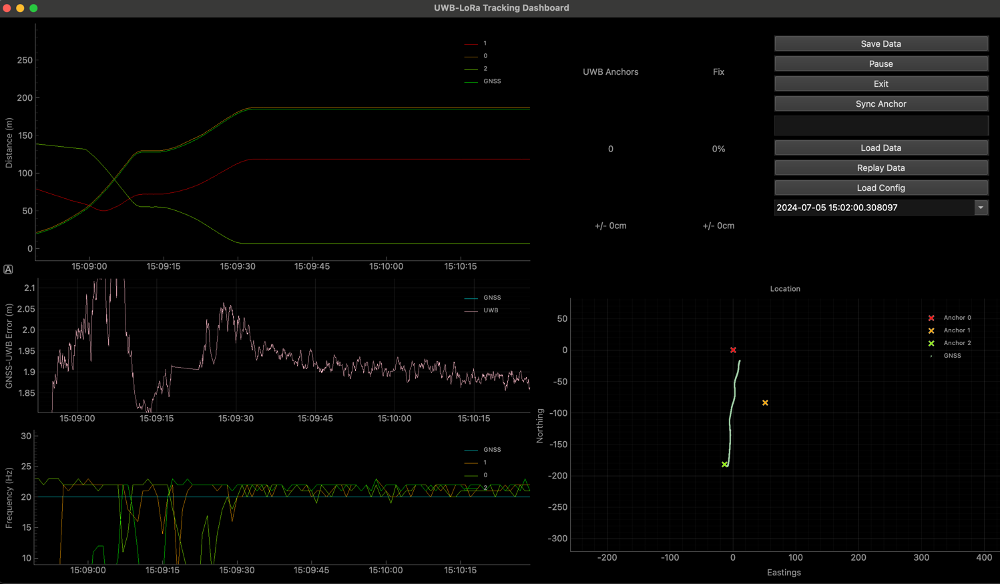
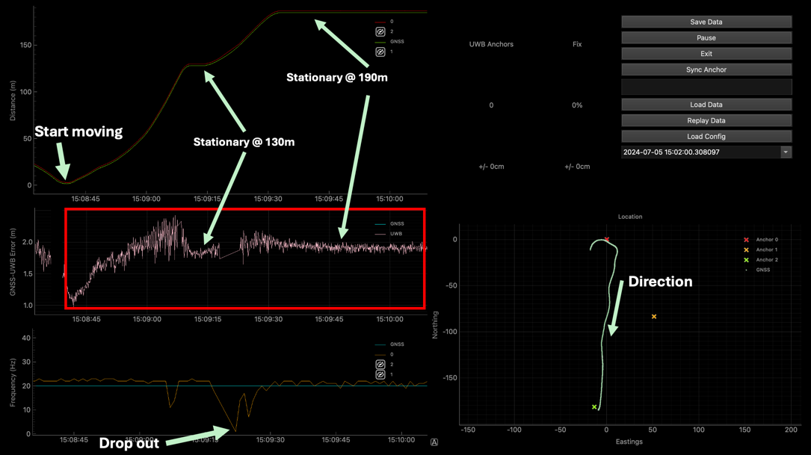

# Live UWB Positioning Dashboard

This project forms a subset of a larger undergraduate engineering thesis for the University of New South Wales. 

The wider project focuses on the localisation of a UGV (in our case, tractor) within a GNSS-denied (either partial or full blockage) area. 
In our case, this is an orchard, vineyard or greenhouse.

# Installation

Simple clone the repository, and install the requirements. Then run the project:

```bash
python3 -m pip install -r requirements.txt
python3 -m dashboard
```

# Usage

For live viewing, run the project, connect a USB-Serial adapter for GNSS, and the UWB tag for positioning.

You may need to change the serial ports / baudrates in the `dashboard/config.py` file.

# Screenshots

Here are some screenshots of the dashboard with data:







# License

This project is licensed under MIT. Please see the [License](LICENSE) file for more information.
